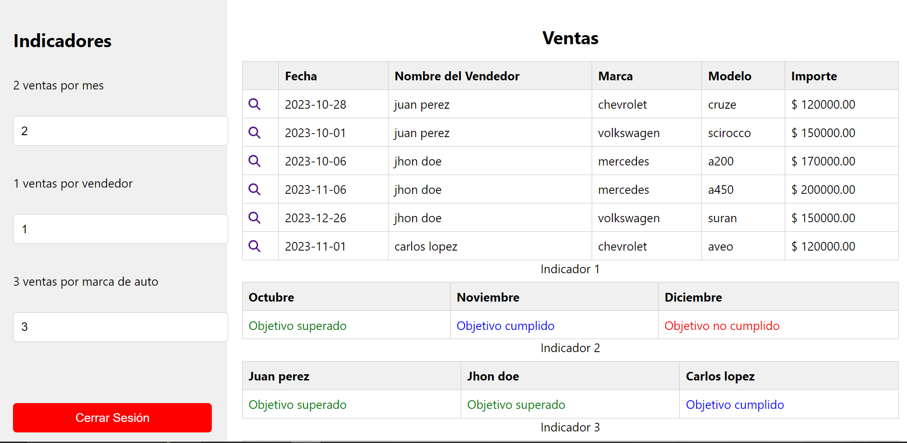

# Tableros

## Requisitos Previos

Antes de comenzar, asegúrate de tener instalado en tu máquina:

- React

## Configuración del Proyecto

1. **Clona el Repositorio:**
   ```bash
   git clone https://github.com/joaquin8123/Tableros.git

2. **Instala las dependencias**  
    ```bash
        npm i 


4. **Ejecuta la aplicacion**
    ```bash
        npm start


## Imagenes



